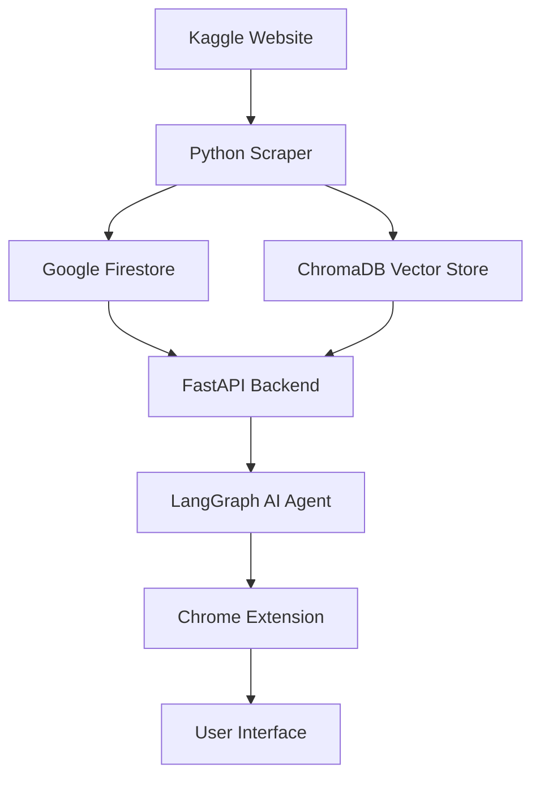

# Kaggler - AI-Powered Kaggle Competition Assistant

A comprehensive AI assistant for Kaggle competitions that automatically scrapes competition data, provides intelligent analysis, and offers a seamless browser extension interface for enhanced productivity.

## 🎯 Overview

Kaggler is a three-component system designed to supercharge your Kaggle competition workflow:

1. **🕷️ Intelligent Scraper** - Automatically collects and processes Kaggle competition data
2. **🤖 AI Backend** - Provides intelligent analysis and assistance using advanced RAG (Retrieval-Augmented Generation)
3. **🌐 Browser Extension** - Seamless Chrome extension for real-time AI assistance while browsing Kaggle

## 🏗️ Architecture



### Data Flow
1. **Scraper** extracts competition data, discussions, and metadata from Kaggle
2. **Raw data** is stored in Google Firestore for persistence
3. **Vector embeddings** are created and stored in ChromaDB for semantic search
4. **Backend API** serves the AI agent with access to both structured and vector data
5. **Chrome Extension** provides a user-friendly interface for real-time assistance

## 🚀 Quick Start

### Prerequisites
- Python 3.12+
- Node.js 18+
- Google Cloud Project with Firestore enabled
- OpenAI API key

### 1. Clone the Repository
```bash
git clone https://github.com/your-username/kaggler.git
cd kaggler
```

### 2. Set Up Environment
```bash
# Install Python dependencies
pip install -r requirements.txt
playwright install chromium
python -m spacy download en_core_web_sm

# Set up environment variables
cp .env.example .env
# Edit .env with your credentials
```

### 3. Configure Google Cloud
- Create a service account with Firestore permissions
- Download the JSON key file to `credentials/serviceAccount.json`
- Set `GOOGLE_APPLICATION_CREDENTIALS` in your environment

### 4. Run Components

#### Start the Scraper (one-time or scheduled)
```bash
cd scraper
python src/scraper.py
```

#### Start the Backend API
```bash
cd backend
python api.py
```

#### Install the Chrome Extension
1. Build the extension: `cd extension && npm run build`
2. Open Chrome → Extensions → Developer mode
3. Load unpacked → Select `extension/dist` folder

## 📦 Components

### 🕷️ [Scraper](./scraper/README.md)
- **Technology**: Python 3.12, Playwright, spaCy
- **Purpose**: Automated data collection from Kaggle
- **Features**: 
  - Competition metadata extraction
  - Discussion scraping with content analysis
  - Text normalization for optimal RAG performance
  - Automated scheduling via GitHub Actions
  - Incremental updates to avoid redundancy

### 🤖 [Backend](./backend/README.md)
- **Technology**: FastAPI, LangGraph, OpenAI, ChromaDB
- **Purpose**: AI-powered analysis and assistance
- **Features**:
  - Streaming chat API for real-time responses
  - RAG-based knowledge retrieval
  - Competition-specific context awareness
  - Advanced prompt engineering for Kaggle-specific queries
  - Thread-based conversation management

### 🌐 [Extension](./extension/README.md)
- **Technology**: React, TypeScript, Vite, Chrome Extension API
- **Purpose**: Browser-integrated user interface
- **Features**:
  - Side panel integration with Chrome
  - Real-time chat interface
  - Competition context detection
  - Beautiful, responsive UI
  - Seamless API integration

## 🛠️ Development

### Project Structure
```
kaggler/
├── scraper/              # Python scraper component
│   ├── src/
│   │   ├── scraper.py    # Main scraping logic
│   │   ├── utils.py      # Text processing utilities
│   │   └── extract_content.js
│   └── README.md
├── backend/              # FastAPI backend
│   ├── api.py           # FastAPI server
│   ├── kaggler.py       # LangGraph AI agent
│   ├── prompts.py       # Prompt templates
│   └── README.md
├── extension/            # Chrome extension
│   ├── src/
│   │   ├── App.tsx      # Main React component
│   │   └── components/  # UI components
│   ├── public/
│   │   └── manifest.json
│   └── README.md
├── requirements.txt      # Python dependencies
└── README.md            # This file
```

### Development Workflow
1. **Data Collection**: Run scraper to populate Firestore and ChromaDB
2. **Backend Development**: Start FastAPI server for API development
3. **Frontend Development**: Use Vite dev server for extension development
4. **Testing**: Load extension in Chrome for end-to-end testing

### Environment Variables
```bash
# Required for all components
OPENAI_API_KEY=your_openai_api_key
GOOGLE_APPLICATION_CREDENTIALS=path/to/serviceAccount.json

# Scraper specific
LAST_SCRAPE_DATETIME=2025-05-26T00:00:00.000000+00:00

# Backend specific
CHROMA_DB_PATH=./chroma_competitions_db
API_HOST=localhost
API_PORT=8000
```

## 🔧 Configuration

### Scraper Configuration
- **Schedule**: Runs every 4 hours via GitHub Actions
- **Data Sources**: Kaggle competitions and discussions
- **Storage**: Google Firestore + ChromaDB for vector search
- **Text Processing**: spaCy for advanced normalization

### Backend Configuration
- **AI Model**: OpenAI GPT-4 (configurable)
- **Vector Store**: ChromaDB for semantic search
- **API Framework**: FastAPI with streaming support
- **Agent Framework**: LangGraph for complex reasoning workflows

### Extension Configuration
- **Manifest**: Chrome Extension Manifest V3
- **UI Framework**: React with TypeScript
- **Build Tool**: Vite for fast development and building
- **API Integration**: Streaming WebSocket support

## 🚀 Deployment

### Scraper Deployment
- Automated via GitHub Actions
- Runs on schedule with proper secret management
- Supports manual triggers for immediate data updates

### Backend Deployment
- Deploy to any Python-compatible platform (Heroku, Railway, etc.)
- Ensure environment variables are properly configured
- Consider using Docker for consistent deployments

### Extension Distribution
- Build production version: `npm run build`
- Package for Chrome Web Store or distribute as unpacked extension
- Ensure API endpoints are configured for production

## 🧪 Testing

### Running Tests
```bash
# Python components
python -m pytest scraper/tests/
python -m pytest backend/tests/

# Extension components  
cd extension
npm test
```

### Manual Testing
1. Run scraper to ensure data collection works
2. Start backend and test API endpoints
3. Load extension and verify UI functionality
4. Test end-to-end workflow with real Kaggle data

## 🤝 Contributing

1. Fork the repository
2. Create a feature branch: `git checkout -b feature/amazing-feature`
3. Commit your changes: `git commit -m 'Add amazing feature'`
4. Push to the branch: `git push origin feature/amazing-feature`
5. Open a Pull Request

### Development Guidelines
- Follow PEP 8 for Python code
- Use TypeScript strict mode for extension development
- Add tests for new functionality
- Update documentation for significant changes
- Ensure all components work together in integration tests

## 📊 Monitoring & Analytics

### Scraper Monitoring
- GitHub Actions logs for automated runs
- Firestore console for data verification
- Runtime metrics and error tracking

### Backend Monitoring
- FastAPI automatic documentation at `/docs`
- Streaming response monitoring
- Vector search performance metrics

### Extension Analytics
- Chrome extension usage statistics
- User interaction tracking (privacy-compliant)
- Performance monitoring for UI responsiveness

## 🔒 Security & Privacy

- **API Keys**: Stored as environment variables and GitHub secrets
- **Data Privacy**: No personal data collection beyond usage analytics
- **Chrome Permissions**: Minimal required permissions (sidePanel only)
- **Data Encryption**: All data stored in secure cloud services

## 📈 Roadmap

- [ ] **Multi-platform Extension**: Firefox and Edge support
- [ ] **Advanced Analytics**: Competition performance prediction
- [ ] **Team Collaboration**: Shared workspaces and insights
- [ ] **Mobile App**: React Native companion app
- [ ] **Integration**: Jupyter Notebook plugin
- [ ] **MLOps**: Model training pipeline integration

## 📄 License

This project is licensed under the MIT License - see the [LICENSE](LICENSE) file for details.

## 🙋‍♂️ Support

- **Issues**: [GitHub Issues](https://github.com/your-username/kaggler/issues)
- **Discussions**: [GitHub Discussions](https://github.com/your-username/kaggler/discussions)
- **Email**: support@kaggler.ai

---

**Built with ❤️ for the Kaggle community**
