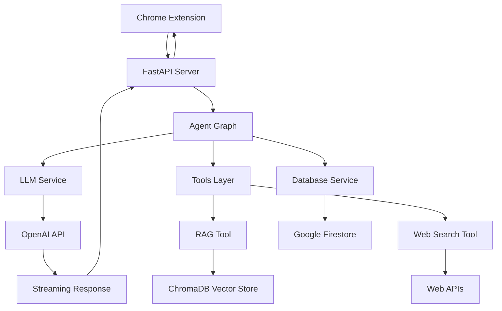

# Kaggler Backend - AI-Powered Competition Assistant API

A sophisticated, modular FastAPI backend that provides intelligent assistance for Kaggle competitions using LangGraph-based AI agents, vector search, and streaming responses.

## 🎯 Overview

The Kaggler backend serves as the intelligence layer of the Kaggler ecosystem, providing:

- **🤖 AI Agent**: LangGraph-powered assistant specialized for Kaggle competitions
- **🔍 RAG System**: Retrieval-Augmented Generation using ChromaDB for semantic search
- **⚡ Streaming API**: Real-time responses via FastAPI streaming endpoints
- **📊 Context Awareness**: Competition-specific knowledge and recommendations
- **🧵 Memory Management**: Conversation history with automatic summarization
- **🏗️ Modular Architecture**: Clean separation of concerns across services, agents, tools, and models

## 🏗️ Architecture

### High-Level Architecture


### Modular Components

#### 🎯 **Core Services** (`src/services/`)
- **LLM Service** (`llm_service.py`) - OpenAI integration and model management
- **Database Service** (`database.py`) - Firestore integration and data access

#### 🤖 **Agent Layer** (`src/graph/`)
- **Main Agent Graph** (`main_agent_graph.py`) - LangGraph orchestration and workflow
- **Memory Management** - Conversation summarization (keeps last 3 of 10+ messages)

#### 🛠️ **Tools Layer** (`src/tools/`)
- **RAG Tool** (`rag_tool.py`) - ChromaDB vector search and retrieval
- **Web Search Tool** (`web_search_tool.py`) - External web search capabilities

#### 📊 **Models Layer** (`src/models/`)
- **State Models** (`state.py`) - Pydantic models for agent state management
- **Request/Response Models** - API contract definitions

#### 🎮 **Interface Layer**
- **FastAPI Server** (`api.py`) - HTTP API with streaming endpoints
- **CLI Interface** (`src/main.py`) - Interactive command-line interface

## 🚀 Quick Start

### Prerequisites
- Python 3.12+
- OpenAI API key
- Google Cloud credentials (for Firestore)
- ChromaDB vector database (populated by scraper)

### Installation

1. **Install dependencies:**
   ```bash
   cd backend
   pip install -r ../requirements.txt
   ```

2. **Set up environment variables:**
   ```bash
   # Create .env file in project root
   echo "OPENAI_API_KEY=your_openai_api_key_here" >> ../.env
   echo "GOOGLE_APPLICATION_CREDENTIALS=../credentials/serviceAccount.json" >> ../.env
   echo "CHROMA_DB_PATH=../chroma_competitions_db" >> ../.env
   ```

3. **Start the application:**

   **Option A: CLI Interface (Interactive)**
   ```bash
   python src/main.py
   ```

   **Option B: API Server**
   ```bash
   python api.py
   ```

The API will be available at `http://localhost:8000` with automatic documentation at `http://localhost:8000/docs`.

## 📁 Project Structure

```
backend/
├── api.py                          # FastAPI server with streaming endpoints
├── src/
│   ├── __init__.py                # Path setup and module initialization
│   ├── main.py                    # CLI interface for interactive usage
│   ├── graph/
│   │   └── main_agent_graph.py    # LangGraph agent orchestration
│   ├── services/
│   │   ├── llm_service.py         # OpenAI integration and model management
│   │   └── database.py            # Firestore integration and data access
│   ├── tools/
│   │   ├── rag_tool.py            # ChromaDB vector search tool
│   │   └── web_search_tool.py     # Web search capabilities
│   └── models/
│       └── state.py               # Pydantic state models
├── README.md                      # This file
└── requirements.txt               # Dependencies
```

### Key Architectural Benefits

1. **Separation of Concerns**: Each layer has a specific responsibility
2. **Testability**: Modular components are easier to unit test
3. **Maintainability**: Changes in one layer don't affect others
4. **Scalability**: Components can be scaled independently
5. **Reusability**: Services and tools can be reused across different agents

## 📡 API Endpoints

### 1. Chat Endpoint (Working)
**POST** `/chat`

Get complete chat responses for Kaggle competition queries.

#### Request Body
```json
{
  "query": "How should I approach the Titanic competition?",
  "competition_id": "titanic",  // optional
  "thread_id": "user_session_1" // optional, defaults to "default"
}
```

#### Response
JSON response with complete message:
```json
{
  "response": "Based on the Titanic competition, I recommend starting with exploratory data analysis...",
  "thread_id": "user_session_1"
}
```

### 2. Streaming Chat Endpoint (In Development)
**POST** `/chat/stream`

Stream chat responses for real-time interaction (currently under development).

#### Usage Examples

**Python**
```python
import requests

response = requests.post(
    'http://localhost:8000/chat',
    json={
        "query": "Explain the evaluation metric for this competition",
        "competition_id": "house-prices-advanced-regression-techniques"
    }
)

result = response.json()
print(result["response"])
```

**cURL**
```bash
curl -X POST "http://localhost:8000/chat" \
     -H "Content-Type: application/json" \
     -d '{"query": "What are the key features for the Titanic dataset?", "competition_id": "titanic"}'
```

### 3. Health Check
**GET** `/health`

Check server status and dependencies.

#### Response
```json
{
  "status": "healthy",
  "timestamp": "2025-05-26T10:30:00Z"
}
```

## 🤖 AI Agent Architecture

### Modular Agent Design

The AI agent follows a clean, modular architecture with clear separation of concerns:

#### 1. **Agent Graph** (`src/graph/main_agent_graph.py`)
LangGraph-based orchestration that coordinates the entire workflow:

```python
class MainAgentGraph:
    def __init__(self):
        self.llm_service = LLMService()
        self.database_service = DatabaseService()
        self.memory = MemorySaver()
        self.graph = self._create_graph()
    
    def _create_graph(self):
        workflow = StateGraph(AgentState)
        # Workflow definition with nodes and edges
        return workflow.compile(checkpointer=self.memory)
```

#### 2. **State Management** (`src/models/state.py`)
Pydantic models define the agent's state structure:

```python
class AgentState(TypedDict):
    messages: Annotated[List[BaseMessage], add_messages]
    competition_context: Optional[str]
    retrieved_docs: Optional[List[str]]
    current_competition: Optional[str]
    thread_id: str
    summary: Optional[str]
```

#### 3. **Memory Management**
Intelligent conversation management with automatic summarization:
- **Conversation History**: Maintains context across interactions
- **Smart Summarization**: When >10 messages exist, summarizes conversation and keeps last 3 messages
- **Memory Efficiency**: Prevents memory bloat while preserving context

```python
def should_summarize(messages: List[BaseMessage]) -> bool:
    return len(messages) > 10

def summarize_conversation(messages: List[BaseMessage]) -> str:
    # Keep last 3 messages, summarize the rest
    to_summarize = messages[:-3]
    # LLM-based summarization logic
```

### Agent Capabilities

1. **Context Retrieval**: Uses RAG tool to search ChromaDB for relevant information
2. **Data Analysis**: Analyzes competition datasets and requirements  
3. **Strategy Recommendation**: Provides ML approach suggestions
4. **Code Generation**: Generates starter code and examples
5. **Performance Optimization**: Suggests improvements and best practices
6. **Memory Management**: Automatically manages conversation history

### Tool Integration

#### RAG Tool (`src/tools/rag_tool.py`)
Handles vector search and knowledge retrieval:
```python
class RAGTool:
    def search_competitions(self, query: str, n_results: int = 5):
        # ChromaDB semantic search implementation
        collection = self.client.get_collection("competitions")
        results = collection.query(query_texts=[query], n_results=n_results)
        return results
```

#### Web Search Tool (`src/tools/web_search_tool.py`)  
Provides external web search capabilities:
```python
class WebSearchTool:
    def search_web(self, query: str) -> List[str]:
        # External web search implementation
        # Returns relevant web content
```

## 🔧 Services Layer

### LLM Service (`src/services/llm_service.py`)
Manages OpenAI integration and model configuration:

```python
class LLMService:
    def __init__(self):
        self.llm = ChatOpenAI(
            model="gpt-4o-mini",  # Optimized model choice
            temperature=0.1,
            streaming=True
        )
    
    def invoke(self, messages: List[BaseMessage]) -> BaseMessage:
        return self.llm.invoke(messages)
```

### Database Service (`src/services/database.py`) 
Handles Firestore integration and data access:

```python
class DatabaseService:
    def __init__(self):
        self.db = firestore.Client()
    
    def get_competition_data(self, competition_id: str):
        # Firestore query implementation
        doc_ref = self.db.collection('competitions').document(competition_id)
        return doc_ref.get()
```

## 🔍 Vector Search Integration

### ChromaDB Setup
The RAG tool integrates with ChromaDB for semantic search:

```python
# In src/tools/rag_tool.py
class RAGTool:
    def __init__(self):
        self.client = chromadb.PersistentClient(path=chroma_db_path)
        self.collection = self.client.get_collection("competitions")

    def search_competitions(self, query: str, n_results: int = 5):
        results = self.collection.query(
            query_texts=[query],
            n_results=n_results,
            include=["documents", "metadatas"]
        )
        return results
```

### Search Capabilities
- **Semantic Search**: Find relevant competitions by description
- **Code Search**: Locate similar solution approaches  
- **Discussion Search**: Find relevant community discussions
- **Feature Search**: Identify important dataset features

## 🧵 Memory Management

### Conversation Persistence
The agent maintains intelligent conversation context:

```python
# Memory management in main_agent_graph.py
def should_summarize(state: AgentState) -> bool:
    return len(state["messages"]) > 10

def summarize_conversation(state: AgentState) -> AgentState:
    messages = state["messages"]
    # Keep last 3 messages, summarize the rest
    to_summarize = messages[:-3]
    recent_messages = messages[-3:]
    
    # Create summary using LLM
    summary = create_summary(to_summarize)
    
    # Create new state with summary and recent messages
    return {
        **state,
        "messages": recent_messages,
        "summary": summary
    }
```

### Context Preservation Features
- **Competition Context**: Remembers current competition being discussed
- **Conversation Flow**: Maintains context for follow-up questions  
- **Memory Efficiency**: Prevents memory bloat with smart summarization
- **Thread Management**: Separate conversation threads for different users/sessions

## ⚡ Performance & Configuration

### Environment Variables
```bash
# Required
OPENAI_API_KEY=sk-...                              # OpenAI API key
GOOGLE_APPLICATION_CREDENTIALS=path/to/service.json # Google Cloud credentials

# Optional  
CHROMA_DB_PATH=./chroma_competitions_db            # ChromaDB location
API_HOST=localhost                                 # Server host
API_PORT=8000                                      # Server port
LOG_LEVEL=INFO                                     # Logging level
```

### Model Configuration
Configure the LLM in `src/services/llm_service.py`:

```python
class LLMService:
    def __init__(self):
        self.llm = ChatOpenAI(
            model="gpt-4o-mini",    # Change model as needed
            temperature=0.1,        # Adjust creativity
            streaming=True          # Enable streaming
        )
```

### Performance Optimizations

#### Memory Management
- **Automatic Summarization**: Prevents memory bloat in long conversations
- **Efficient State Storage**: Minimal state footprint with Pydantic models
- **Thread Isolation**: Separate memory spaces for different conversations

#### Caching Strategy
- **Vector Search Results**: Cache frequent queries in RAG tool
- **Competition Metadata**: Cache competition information in database service  
- **Model Responses**: Potential for response caching for common questions

## 🔧 Development

### Running in Development Mode

**CLI Interface (Recommended for Development)**
```bash
# Interactive development and testing
python src/main.py
```

**API Server**
```bash
# FastAPI server with auto-reload
uvicorn api:app --reload --host 0.0.0.0 --port 8000

# With debug logging
LOG_LEVEL=DEBUG python api.py
```

### Testing
```bash
# Run unit tests (when test suite is added)
python -m pytest tests/

# Test CLI interface
python src/main.py

# Test API endpoints
curl -X POST "http://localhost:8000/chat" \
     -H "Content-Type: application/json" \
     -d '{"query": "Test query"}'
```

### Development Workflow
1. **Start with CLI**: Use `python src/main.py` for quick testing
2. **Develop Components**: Modify services, tools, or agent logic
3. **Test Integration**: Use API endpoints for full workflow testing
4. **Debug Issues**: Utilize logging and error handling

## 🚀 Deployment

### Production Deployment
```bash
# Using uvicorn
uvicorn api:app --host 0.0.0.0 --port 8000 --workers 4

# Using gunicorn (recommended for production)
gunicorn api:app -w 4 -k uvicorn.workers.UvicornWorker
```

### Docker Deployment
```dockerfile
FROM python:3.12-slim

WORKDIR /app
COPY requirements.txt .
RUN pip install -r requirements.txt

COPY . .
EXPOSE 8000

CMD ["uvicorn", "api:app", "--host", "0.0.0.0", "--port", "8000"]
```

### Environment Configuration
```bash
# Production environment variables
OPENAI_API_KEY=your_production_key
GOOGLE_APPLICATION_CREDENTIALS=/app/credentials/service.json
CHROMA_DB_PATH=/app/data/chroma_db
API_HOST=0.0.0.0
API_PORT=8000
LOG_LEVEL=INFO
```

## 📊 Monitoring & Security

### Health Checks
The API includes health checking:
- Basic server status
- Timestamp information
- Component availability (future enhancement)

### Logging
Structured logging across all components:
```python
import logging

# Service-level logging
logger = logging.getLogger(__name__)
logger.info(f"Processing query: {query[:100]}...")
logger.info(f"Retrieved {len(docs)} relevant documents")
```

### Security Features
- **CORS**: Configured for frontend domains
- **Input Validation**: Pydantic models for request validation  
- **API Keys**: Secure environment-based credential management
- **Data Privacy**: Conversations managed in memory, not permanently stored

## 🧪 Examples

### Example 1: CLI Usage
```bash
$ python src/main.py
Welcome to Kaggler! Ask me anything about Kaggle competitions.
Type 'exit' to quit.

You: How should I approach the Titanic competition?
Kaggler: Based on the Titanic competition, I recommend starting with...
[Detailed response with analysis and recommendations]

You: What features should I focus on?
Kaggler: For the Titanic dataset, the most important features are...
[Continues conversation with context]
```

### Example 2: API Usage
```python
import requests

# Competition analysis request
response = requests.post(
    'http://localhost:8000/chat',
    json={
        "query": "Analyze the House Prices competition",
        "competition_id": "house-prices-advanced-regression-techniques"
    }
)

result = response.json()
print(result["response"])
# Returns detailed competition analysis including:
# - Competition type (regression)
# - Evaluation metric (RMSE)  
# - Dataset characteristics
# - Recommended approaches
# - Feature engineering tips
```

### Example 3: Technical Implementation Query
```python
# Request for baseline model
response = requests.post(
    'http://localhost:8000/chat',
    json={
        "query": "Show me a baseline model for Titanic",
        "thread_id": "user_123"
    }
)

# Response includes:
# - Data preprocessing code
# - Feature engineering examples  
# - Model implementation
# - Evaluation code
```

## 🔄 Migration from Monolithic Architecture

This backend has been restructured from a monolithic `kaggler.py` file to a clean, modular architecture:

### Before (Monolithic)
```
backend/
├── kaggler.py    # Everything in one file
├── api.py        # Basic API endpoints
└── prompts.py    # Prompt templates
```

### After (Modular)
```
backend/
├── api.py                          # Clean API layer
├── src/
│   ├── main.py                    # CLI interface
│   ├── graph/main_agent_graph.py  # Agent orchestration
│   ├── services/                  # Business logic
│   ├── tools/                     # Tool implementations  
│   └── models/                    # Data models
```

### Benefits of Restructuring
1. **Maintainability**: Easier to modify individual components
2. **Testability**: Each module can be tested independently
3. **Scalability**: Components can be optimized separately
4. **Reusability**: Services and tools can be reused
5. **Memory Management**: Intelligent conversation summarization
6. **Development Experience**: Cleaner codebase for new developers

## 🤝 Contributing

1. Fork the repository
2. Create a feature branch (`git checkout -b feature/amazing-feature`)
3. Make your changes following the modular architecture
4. Add tests for new functionality
5. Ensure all tests pass
6. Submit a pull request

### Development Guidelines
- **Follow the modular structure**: Keep services, agents, tools, and models separate
- **Add type hints**: Use Python type hints for all functions
- **Include docstrings**: Document public methods and classes
- **Write tests**: Add unit tests for new components
- **Update documentation**: Keep README current with changes
- **Follow PEP 8**: Use consistent Python style guidelines

### Architecture Guidelines
- **Services**: Business logic and external integrations
- **Agents**: LangGraph orchestration and workflow
- **Tools**: Specific capabilities (RAG, web search, etc.)
- **Models**: Pydantic data models and state definitions

## 📄 License

MIT License - see the [LICENSE](../LICENSE) file for details.

---

**Part of the Kaggler ecosystem - AI-powered Kaggle competition assistance**

*Successfully restructured from monolithic architecture to clean, modular design with proper separation of concerns, memory management, and streaming capabilities.*
