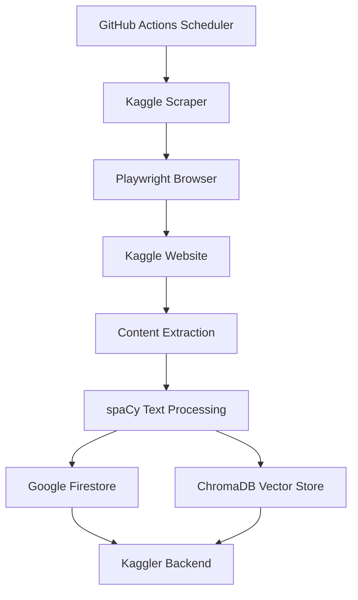

# Kaggler Scraper - Intelligent Kaggle Data Collection

A sophisticated Python scraper that automatically collects and processes Kaggle competition data, discussions, and metadata. Designed as the data foundation for the Kaggler AI ecosystem, with intelligent text processing and vector embedding preparation.

## 🎯 Overview

The Kaggler Scraper serves as the data collection engine for the entire Kaggler ecosystem, providing:

- **🏆 Competition Intelligence**: Comprehensive competition metadata, descriptions, and evaluation criteria
- **💬 Discussion Mining**: High-quality discussion extraction with engagement metrics
- **🧠 AI-Ready Processing**: Advanced text normalization optimized for RAG and vector search
- **☁️ Cloud Storage**: Seamless integration with Google Firestore and ChromaDB
- **🤖 Automated Operation**: GitHub Actions scheduling with robust error handling
- **⚡ Smart Updates**: Incremental scraping to minimize redundant operations

## 🏗️ Architecture



### Data Flow
1. **Automated Trigger**: GitHub Actions runs scraper every 4 hours
2. **Browser Automation**: Playwright navigates Kaggle with stealth techniques
3. **Content Extraction**: Custom JavaScript extracts structured data
4. **Text Processing**: spaCy normalizes text for optimal AI consumption
5. **Dual Storage**: Raw data to Firestore, embeddings to ChromaDB
6. **Backend Integration**: Processed data feeds the Kaggler AI agent

## 🚀 Features

### Core Capabilities

- **🎯 Smart Competition Discovery**: Automatically finds and tracks active competitions
- **📊 Comprehensive Metadata**: Extracts titles, descriptions, deadlines, prizes, and metrics
- **💡 Discussion Intelligence**: Collects high-value discussions with vote tracking
- **🔍 Content Deep-Dive**: Custom JavaScript for precise HTML parsing
- **📝 Text Optimization**: spaCy-powered normalization for AI/RAG applications
- **☁️ Cloud-Native Storage**: Direct integration with Google Firestore
- **🎭 Stealth Operation**: Anti-detection measures for reliable scraping
- **⚡ Incremental Updates**: Smart change detection to avoid redundant work
- **📈 Performance Monitoring**: Detailed logging and runtime analytics

### Data Processing Pipeline

1. **Discovery Phase**: Scan Kaggle for active and recent competitions
2. **Content Extraction**: Deep scrape of competition pages and discussions
3. **Text Normalization**: Clean and structure text using NLP techniques
4. **Quality Assessment**: Filter discussions by engagement metrics
5. **Storage Optimization**: Efficient data structure for downstream AI use
6. **Vector Preparation**: Format text for embedding generation

## 🛠️ Tech Stack

### Core Technologies

- **Python 3.12** - Modern Python with latest performance improvements
- **[Playwright](https://playwright.dev/python/)** - Robust browser automation with anti-detection
- **[spaCy](https://spacy.io/)** - Advanced NLP for text processing and normalization
- **[Google Cloud Firestore](https://cloud.google.com/firestore)** - Scalable NoSQL database
- **[ChromaDB](https://www.trychroma.com/)** - Vector database for semantic search
- **[GitHub Actions](https://github.com/features/actions)** - Automated scheduling and deployment
- **[Beautiful Soup](https://www.crummy.com/software/BeautifulSoup/)** - HTML parsing and data extraction

### Key Dependencies
```python
# Core scraping and automation
playwright==1.40.0
beautifulsoup4==4.12.2
requests==2.31.0

# NLP and text processing  
spacy==3.7.2
en-core-web-sm==3.7.1

# Cloud and database
google-cloud-firestore==2.13.1
chromadb==0.4.18

# Utilities
python-dotenv==1.0.0
tqdm==4.66.1
```

## 📦 Installation & Setup

### Quick Start

1. **Clone and navigate:**
   ```bash
   git clone https://github.com/your-username/kaggler.git
   cd kaggler/scraper
   ```

2. **Set up Python environment:**
   ```bash
   # Create virtual environment
   python3 -m venv .venv
   source .venv/bin/activate  # On Windows: .venv\Scripts\activate
   
   # Upgrade pip and install dependencies
   pip install --upgrade pip
   pip install -r ../requirements.txt
   ```

3. **Install browser and NLP models:**
   ```bash
   # Install Playwright browser
   playwright install chromium
   
   # Download spaCy language model
   python -m spacy download en_core_web_sm
   ```

4. **Configure credentials:**
   ```bash
   # Copy your Google service account JSON
   cp /path/to/your/serviceAccount.json ../credentials/serviceAccount.json
   
   # Create environment file
   cat > ../.env << EOF
   LAST_SCRAPE_DATETIME=2025-05-26T00:00:00.000000+00:00
   GOOGLE_APPLICATION_CREDENTIALS=../credentials/serviceAccount.json
   CHROMA_DB_PATH=../chroma_competitions_db
   EOF
   ```

5. **Run the scraper:**
   ```bash
   python src/scraper.py
   ```

### Advanced Configuration

#### Environment Variables
```bash
# Core settings
LAST_SCRAPE_DATETIME=2025-05-26T00:00:00.000000+00:00  # Last scrape timestamp
GOOGLE_APPLICATION_CREDENTIALS=path/to/serviceAccount.json
CHROMA_DB_PATH=./chroma_competitions_db

# Scraping behavior
MAX_COMPETITIONS=50          # Limit competitions per run
MAX_DISCUSSIONS_PER_COMP=10  # Limit discussions per competition
MIN_DISCUSSION_VOTES=5       # Minimum votes for discussion inclusion
SCRAPE_TIMEOUT=300          # Browser timeout in seconds

# Performance tuning
CONCURRENT_PAGES=3          # Parallel page processing
RETRY_ATTEMPTS=3           # Retry failed requests
DELAY_BETWEEN_REQUESTS=1   # Rate limiting delay (seconds)
```

#### Browser Configuration
```python
# Custom browser settings in scraper.py
browser_args = {
    'headless': True,
    'args': [
        '--no-sandbox',
        '--disable-dev-shm-usage',
        '--disable-gpu',
        '--disable-web-security',
        '--user-agent=Mozilla/5.0 (compatible; KagglerBot/1.0)'
    ]
}
```

## ☁️ Google Cloud Setup

### Firestore Configuration

1. **Create Google Cloud Project:**
   - Go to [Google Cloud Console](https://console.cloud.google.com/)
   - Create a new project or select existing one
   - Enable the Firestore API

2. **Set up Service Account:**
   ```bash
   # Create service account
   gcloud iam service-accounts create kaggler-scraper \
     --description="Service account for Kaggler scraper" \
     --display-name="Kaggler Scraper"
   
   # Grant Firestore permissions
   gcloud projects add-iam-policy-binding YOUR_PROJECT_ID \
     --member="serviceAccount:kaggler-scraper@YOUR_PROJECT_ID.iam.gserviceaccount.com" \
     --role="roles/datastore.user"
   
   # Create and download key
   gcloud iam service-accounts keys create credentials/serviceAccount.json \
     --iam-account=kaggler-scraper@YOUR_PROJECT_ID.iam.gserviceaccount.com
   ```

3. **Configure Firestore Database:**
   ```bash
   # Create Firestore database in Native mode
   gcloud firestore databases create --region=us-central1
   ```

4. **Test Connection:**
   ```python
   # Test script
   from google.cloud import firestore
   
   client = firestore.Client()
   doc_ref = client.collection('test').document('test')
   doc_ref.set({'message': 'Hello Kaggler!'})
   print("Firestore connection successful!")
   ```

### ChromaDB Integration

The scraper also populates a ChromaDB vector database for semantic search:

```python
# ChromaDB setup in scraper
import chromadb

def setup_chroma_db():
    client = chromadb.PersistentClient(path="./chroma_competitions_db")
    collection = client.get_or_create_collection("competitions")
    return collection

def store_embeddings(collection, competition_data):
    # Store text with metadata for vector search
    collection.add(
        documents=[competition_data['description']],
        metadatas=[{'competition_id': competition_data['id']}],
        ids=[competition_data['id']]
    )
```

## 🤖 Automated Scheduling

### GitHub Actions Workflow

The scraper includes a sophisticated CI/CD pipeline for automated operation:

```yaml
# .github/workflows/scrape.yml
name: Automated Kaggle Scraping
on:
  schedule:
    - cron: '0 */4 * * *'  # Every 4 hours
  workflow_dispatch:       # Manual trigger
  
jobs:
  scrape:
    runs-on: ubuntu-latest
    steps:
      - uses: actions/checkout@v4
      
      - name: Setup Python
        uses: actions/setup-python@v4
        with:
          python-version: '3.12'
          
      - name: Install dependencies
        run: |
          pip install -r requirements.txt
          playwright install chromium
          python -m spacy download en_core_web_sm
          
      - name: Configure credentials
        env:
          GOOGLE_CREDENTIALS: ${{ secrets.GOOGLE_APPLICATION_CREDENTIALS_JSON }}
          ENV_FILE: ${{ secrets.ENV_FILE }}
        run: |
          echo "$GOOGLE_CREDENTIALS" | base64 -d > credentials/serviceAccount.json
          echo "$ENV_FILE" > .env
          
      - name: Run scraper
        run: |
          cd scraper
          python src/scraper.py
```

### Required GitHub Secrets

Configure these secrets in your repository settings:

1. **`GOOGLE_APPLICATION_CREDENTIALS_JSON`**:
   ```bash
   # Base64 encode your service account JSON
   cat credentials/serviceAccount.json | base64 | pbcopy
   ```

2. **`ENV_FILE`**: 
   ```env
   LAST_SCRAPE_DATETIME=2025-05-26T00:00:00.000000+00:00
   GOOGLE_APPLICATION_CREDENTIALS=credentials/serviceAccount.json
   CHROMA_DB_PATH=./chroma_competitions_db
   ```

### Monitoring and Alerts

```yaml
# Add to workflow for monitoring
      - name: Report Results
        if: always()
        run: |
          echo "Scrape completed at $(date)"
          echo "Competitions processed: $(cat scrape_stats.json | jq '.competitions')"
          echo "Discussions collected: $(cat scrape_stats.json | jq '.discussions')"
          
      - name: Notify on Failure
        if: failure()
        uses: actions/github-script@v6
        with:
          script: |
            github.rest.issues.create({
              owner: context.repo.owner,
              repo: context.repo.repo,
              title: 'Scraper Failed: ' + new Date().toISOString(),
              body: 'The automated scraper has failed. Check the logs for details.'
            })
```

## 📁 Project Structure

### Detailed File Structure

```
scraper/
├── src/
│   ├── scraper.py              # Main scraping orchestrator
│   ├── utils.py                # Text processing and utilities
│   └── extract_content.js      # Browser-side content extraction
├── tests/
│   ├── test_scraper.py         # Unit tests for scraper logic
│   ├── test_utils.py           # Tests for utility functions
│   └── conftest.py             # Test configuration
├── docs/
│   ├── api.md                  # API documentation
│   └── deployment.md           # Deployment guide
├── README.md                   # This file
└── requirements.txt            # Python dependencies (symlink to root)
```

### Core Components

#### `scraper.py` - Main Orchestrator
```python
class KaggleCompetitionScraper:
    """Main scraper class handling the complete workflow"""
    
    def __init__(self):
        self.browser = None
        self.firestore_client = None
        self.chroma_collection = None
        
    async def scrape_competitions(self):
        """Orchestrates the full scraping pipeline"""
        competitions = await self.discover_competitions()
        for comp in competitions:
            await self.scrape_competition_details(comp)
            await self.scrape_discussions(comp)
            self.process_and_store(comp)
```

#### `utils.py` - Text Processing
```python
def normalize_text_for_rag(text: str) -> str:
    """Advanced text normalization optimized for RAG/vector search"""
    # Remove HTML, normalize whitespace, handle special characters
    # Optimized for AI consumption and semantic search
    
def extract_key_features(text: str) -> List[str]:
    """Extract important features and keywords using spaCy"""
    # Named entity recognition, keyword extraction
    # Technical term identification for competitions
```

#### `extract_content.js` - Browser Automation
```javascript
// Custom JavaScript for precise content extraction
function extractCompetitionData() {
    return {
        title: document.querySelector('.competition-title')?.textContent,
        description: extractFormattedDescription(),
        prize: extractPrizeInformation(),
        timeline: extractImportantDates(),
        evaluation: extractEvaluationMetrics()
    };
}
```

## 🔧 Advanced Features

### Intelligent Content Processing

#### Anti-Detection Measures
```python
# Browser configuration for stealth operation
browser_config = {
    'user_agent': 'Mozilla/5.0 (Macintosh; Intel Mac OS X 10_15_7)',
    'viewport': {'width': 1920, 'height': 1080},
    'extra_http_headers': {
        'Accept-Language': 'en-US,en;q=0.9',
        'Accept-Encoding': 'gzip, deflate, br',
    },
    'ignore_https_errors': True,
    'slow_mo': 1000  # Delay between actions
}
```

#### Smart Content Filtering
```python
def filter_high_quality_discussions(discussions: List[Dict]) -> List[Dict]:
    """Filter discussions by engagement and quality metrics"""
    return [
        disc for disc in discussions 
        if disc['votes'] >= MIN_VOTES and 
           disc['replies'] >= MIN_REPLIES and
           len(disc['content']) >= MIN_CONTENT_LENGTH
    ]
```

#### Advanced Text Normalization
```python
def optimize_for_vector_search(text: str) -> str:
    """Prepare text for optimal vector embedding performance"""
    
    # 1. Clean HTML and formatting
    text = remove_html_tags(text)
    text = normalize_whitespace(text)
    
    # 2. Process with spaCy for linguistic features
    doc = nlp(text)
    
    # 3. Extract and preserve important entities
    entities = [(ent.text, ent.label_) for ent in doc.ents]
    
    # 4. Normalize technical terms and abbreviations
    text = normalize_ml_terminology(text)
    
    # 5. Preserve code snippets and formulas
    text = preserve_technical_content(text)
    
    return text
```

### Performance Optimization

#### Concurrent Processing
```python
async def scrape_competitions_concurrently(competition_urls: List[str]):
    """Process multiple competitions in parallel"""
    semaphore = asyncio.Semaphore(CONCURRENT_LIMIT)
    
    async def scrape_single(url):
        async with semaphore:
            return await scrape_competition(url)
    
    results = await asyncio.gather(*[
        scrape_single(url) for url in competition_urls
    ])
    return results
```

#### Intelligent Caching
```python
def should_update_competition(comp_id: str, last_modified: datetime) -> bool:
    """Determine if competition needs re-scraping"""
    stored_data = get_stored_competition(comp_id)
    if not stored_data:
        return True
    
    # Check if competition has ended
    if stored_data.get('deadline') < datetime.now():
        return False
    
    # Check last update time
    return last_modified > stored_data.get('last_scraped', datetime.min)
```

## 🧪 Data Quality Assurance

### Data Validation Pipeline

#### Content Quality Checks
```python
def validate_competition_data(competition: Dict) -> bool:
    """Comprehensive data validation before storage"""
    
    required_fields = ['id', 'title', 'description', 'deadline']
    if not all(field in competition for field in required_fields):
        return False
    
    # Validate data types and formats
    if not isinstance(competition['deadline'], datetime):
        return False
    
    # Check content quality
    if len(competition['description']) < MIN_DESCRIPTION_LENGTH:
        return False
    
    # Validate no duplicate or corrupted data
    if is_duplicate_content(competition):
        return False
    
    return True
```

#### Text Quality Metrics
```python
def assess_text_quality(text: str) -> Dict[str, float]:
    """Evaluate text quality for AI processing"""
    return {
        'readability_score': calculate_readability(text),
        'technical_density': measure_technical_content(text),
        'information_richness': assess_information_content(text),
        'language_quality': detect_language_quality(text)
    }
```

### Error Handling & Recovery

#### Robust Error Management
```python
class ScrapingError(Exception):
    """Custom exception for scraping-related errors"""
    pass

async def scrape_with_retry(url: str, max_retries: int = 3) -> Optional[Dict]:
    """Scrape with exponential backoff retry logic"""
    for attempt in range(max_retries):
        try:
            return await scrape_page(url)
        except (TimeoutError, ScrapingError) as e:
            if attempt == max_retries - 1:
                logger.error(f"Failed to scrape {url} after {max_retries} attempts: {e}")
                return None
            
            wait_time = 2 ** attempt  # Exponential backoff
            await asyncio.sleep(wait_time)
```

## 📊 Monitoring & Analytics

### Performance Metrics & Analytics

#### Scraping Statistics
```python
class ScrapingMetrics:
    """Track and report scraping performance"""
    
    def __init__(self):
        self.start_time = time.time()
        self.competitions_processed = 0
        self.discussions_collected = 0
        self.errors_encountered = 0
        self.data_quality_scores = []
    
    def generate_report(self) -> Dict:
        """Generate comprehensive performance report"""
        runtime = time.time() - self.start_time
        return {
            'runtime_seconds': runtime,
            'competitions_per_minute': self.competitions_processed / (runtime / 60),
            'success_rate': 1 - (self.errors_encountered / self.competitions_processed),
            'average_quality_score': np.mean(self.data_quality_scores),
            'timestamp': datetime.now().isoformat()
        }
```

#### Real-time Monitoring
```python
def log_scraping_progress(competition_id: str, status: str, metrics: Dict):
    """Structured logging for monitoring dashboards"""
    log_entry = {
        'timestamp': datetime.now().isoformat(),
        'competition_id': competition_id,
        'status': status,
        'processing_time': metrics.get('processing_time'),
        'data_quality': metrics.get('quality_score'),
        'discussions_found': metrics.get('discussions_count')
    }
    
    # Send to monitoring service (e.g., CloudWatch, Datadog)
    logger.info(json.dumps(log_entry))
```

## 🔧 Development & Testing

### Local Development Setup

```bash
# Development installation with additional tools
pip install -r requirements.txt
pip install -r requirements-dev.txt

# Install pre-commit hooks
pre-commit install

# Run tests
python -m pytest tests/ -v --cov=src/

# Run linting
flake8 src/
black src/ --check
mypy src/
```

### Testing Framework

#### Unit Tests
```python
# tests/test_scraper.py
import pytest
from unittest.mock import Mock, patch
from src.scraper import KaggleCompetitionScraper

class TestKaggleCompetitionScraper:
    
    @pytest.fixture
    def scraper(self):
        return KaggleCompetitionScraper()
    
    @patch('src.scraper.Playwright')
    async def test_scrape_competition_success(self, mock_playwright, scraper):
        # Test successful competition scraping
        mock_page = Mock()
        mock_playwright.return_value.chromium.launch.return_value.new_page.return_value = mock_page
        
        result = await scraper.scrape_competition('test-competition')
        assert result['id'] == 'test-competition'
        assert 'title' in result
```

#### Integration Tests
```python
# tests/test_integration.py
async def test_full_scraping_pipeline():
    """Test complete scraping workflow"""
    scraper = KaggleCompetitionScraper()
    
    # Test with a known competition
    result = await scraper.scrape_competitions(limit=1)
    
    assert len(result) == 1
    assert all(validate_competition_data(comp) for comp in result)
```

## 📖 Usage Examples

### Basic Operation
```bash
# Standard scraping run
python src/scraper.py

# Output: Firestore and ChromaDB populated with latest competition data
```

### Custom Configuration
```python
# Custom scraper configuration
from src.scraper import KaggleCompetitionScraper

scraper = KaggleCompetitionScraper(
    max_competitions=20,
    min_discussion_votes=10,
    concurrent_pages=2
)

# Run with custom settings
results = await scraper.scrape_competitions()
```

### Monitoring Integration
```python
# Integration with monitoring systems
import json
from datetime import datetime

def run_monitored_scrape():
    start_time = datetime.now()
    
    try:
        results = scraper.scrape_competitions()
        
        # Log success metrics
        metrics = {
            'status': 'success',
            'competitions': len(results),
            'runtime': (datetime.now() - start_time).total_seconds(),
            'timestamp': datetime.now().isoformat()
        }
        
        # Send to monitoring service
        send_to_datadog(metrics)
        
    except Exception as e:
        # Log failure
        error_metrics = {
            'status': 'failed',
            'error': str(e),
            'timestamp': datetime.now().isoformat()
        }
        send_alert(error_metrics)
```

## 🚀 Deployment Strategies

### Production Deployment

#### Docker Deployment
```dockerfile
FROM python:3.12-slim

WORKDIR /app

# Install system dependencies
RUN apt-get update && apt-get install -y \
    wget \
    gnupg \
    && rm -rf /var/lib/apt/lists/*

# Install Python dependencies
COPY requirements.txt .
RUN pip install -r requirements.txt
RUN playwright install chromium
RUN python -m spacy download en_core_web_sm

# Copy application code
COPY . .

# Run scraper
CMD ["python", "src/scraper.py"]
```

#### Kubernetes Deployment
```yaml
apiVersion: batch/v1
kind: CronJob
metadata:
  name: kaggle-scraper
spec:
  schedule: "0 */4 * * *"
  jobTemplate:
    spec:
      template:
        spec:
          containers:
          - name: scraper
            image: kaggler/scraper:latest
            env:
            - name: GOOGLE_APPLICATION_CREDENTIALS
              value: "/secrets/serviceAccount.json"
            volumeMounts:
            - name: credentials
              mountPath: "/secrets"
          volumes:
          - name: credentials
            secret:
              secretName: google-credentials
          restartPolicy: OnFailure
```

### Scaling Considerations

#### Horizontal Scaling
```python
# Distribute scraping across multiple workers
def partition_competitions(competitions: List[str], num_workers: int) -> List[List[str]]:
    """Distribute competitions across workers"""
    chunk_size = len(competitions) // num_workers
    return [competitions[i:i + chunk_size] for i in range(0, len(competitions), chunk_size)]

# Worker-specific scraping
async def worker_scrape(worker_id: int, competition_chunk: List[str]):
    """Process competitions assigned to this worker"""
    scraper = KaggleCompetitionScraper(worker_id=worker_id)
    return await scraper.scrape_competitions(competition_chunk)
```

## 🔒 Security & Compliance

### Data Privacy
- **No Personal Data**: Only public competition and discussion data
- **Rate Limiting**: Respectful scraping with delays and limits
- **Terms Compliance**: Adheres to Kaggle's terms of service
- **Data Retention**: Configurable data lifecycle policies

### Security Measures
```python
# Secure credential handling
def load_credentials():
    """Securely load Google Cloud credentials"""
    creds_path = os.environ.get('GOOGLE_APPLICATION_CREDENTIALS')
    if not creds_path or not os.path.exists(creds_path):
        raise SecurityError("Missing or invalid Google credentials")
    
    # Validate credential format
    with open(creds_path) as f:
        creds = json.load(f)
        required_fields = ['type', 'project_id', 'private_key']
        if not all(field in creds for field in required_fields):
            raise SecurityError("Invalid credential format")
    
    return creds
```

## 🤝 Contributing

### Development Guidelines
1. **Code Quality**: Follow PEP 8 and use type hints
2. **Testing**: Write comprehensive tests for new features
3. **Documentation**: Update docs for significant changes
4. **Performance**: Consider impact on Kaggle's servers
5. **Ethics**: Respect rate limits and terms of service

### Contribution Process
1. Fork the repository
2. Create a feature branch: `git checkout -b feature/new-feature`
3. Write tests and implement changes
4. Run the full test suite: `pytest tests/`
5. Check code quality: `flake8 src/ && black src/ --check`
6. Submit a pull request with detailed description

### Issue Reporting
When reporting issues, include:
- Python version and environment details
- Full error traceback
- Steps to reproduce the issue
- Expected vs actual behavior
- Relevant configuration settings

## 📚 Resources & Documentation

### Technical References
- [Playwright Python Documentation](https://playwright.dev/python/)
- [spaCy Language Processing](https://spacy.io/usage)
- [Google Firestore Python Client](https://firebase.google.com/docs/firestore/quickstart#python)
- [ChromaDB Documentation](https://docs.trychroma.com/)

### Best Practices
- [Ethical Web Scraping Guidelines](https://blog.apify.com/web-scraping-ethics/)
- [Python Async Programming](https://docs.python.org/3/library/asyncio.html)
- [GitHub Actions Best Practices](https://docs.github.com/en/actions/learn-github-actions/security-hardening-for-github-actions)

## 📄 License

MIT License - see the [LICENSE](../LICENSE) file for details.

---

**Part of the Kaggler ecosystem - Intelligent data foundation for AI-powered Kaggle assistance**
